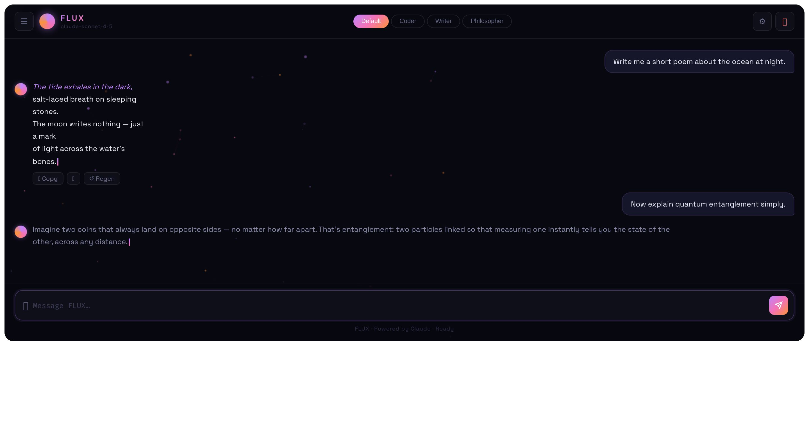

# FLUX — AI Chat Interface

> A beautifully crafted, self-hosted chat interface powered by Claude. Dark theme, gradient aesthetics, streaming responses, and a full feature set — built to be deployed anywhere.



---

## ✦ Features

| Feature | Description |
|---|---|
| 🎨 **Gradient Theme** | Purple → Pink → Orange flowing gradient throughout the UI |
| 🌌 **Particle Background** | Animated canvas particle field with connecting lines |
| 🧠 **Conversation Personas** | Switch between Default, Coder, Writer, and Philosopher modes |
| 💬 **Chat History** | Full sidebar with persistent conversation history via localStorage |
| ⚡ **Streaming Responses** | Real-time SSE token streaming from Claude |
| 📋 **Message Actions** | Copy, 👍 react, and regenerate on every AI message |
| 🎙️ **Voice Input** | Speak your messages via Web Speech API |
| 🔊 **Typing Sounds** | Subtle mechanical click sounds as Claude streams (toggleable) |
| ↓ **Export** | Download any conversation as `.md` or `.txt` |
| 📊 **Token Tracker** | Live token count and estimated cost display |
| ⚙️ **System Prompt Editor** | Customize Claude's behaviour, persisted to localStorage |
| 🔒 **Secure API Key** | Key never touches the browser — proxied via Express server |

---

## 📸 Screenshots

### Main Chat


### Conversation Sidebar


### Settings Drawer


---

## 🚀 Quick Start

### 1. Clone the repo

```bash
git clone https://github.com/yourusername/flux-chat.git
cd flux-chat
```

### 2. Install dependencies

```bash
npm install
```

### 3. Add your API key

```bash
cp .env.example .env
```

Open `.env` and replace the placeholder:

```env
ANTHROPIC_API_KEY=sk-ant-your-real-key-here
PORT=3001
```

### 4. Start the proxy server

```bash
npm run dev
```

### 5. Open the app

Open `index.html` in your browser — or use VS Code Live Server.

> The proxy runs on `http://localhost:3001`. The frontend talks to it automatically.

---

## 📁 Project Structure

```
flux-chat/
├── index.html        ← UI shell & layout
├── style.css         ← Full dark theme with gradient system
├── script.js         ← All frontend logic (streaming, history, voice, etc.)
├── server.js         ← Express proxy — API key never leaves here
├── .env.example      ← Copy to .env and add your key
├── package.json
├── screenshots/
│   ├── main.png
│   ├── sidebar.png
│   └── settings.png
└── README.md
```

---

## 🔐 Why the Proxy Server?

Storing your API key in a frontend `.env` file doesn't protect it — anything in browser JS is fully visible in DevTools to anyone who opens your page.

The Express proxy (`server.js`) sits between your browser and Anthropic's API:

```
Browser → localhost:3001/api/chat → Anthropic API
```

Your `ANTHROPIC_API_KEY` is read from `.env` on the server only. It is never sent to, or readable by, the browser.

---

## 🎭 Persona Modes

Switch personas from the header pills — each sets a hidden system prompt:

| Persona | Behaviour |
|---|---|
| **Default** | Brilliant, creative, occasionally poetic |
| **Coder** | Expert engineer — clean code, working examples, explained reasoning |
| **Writer** | Masterful author — expressive, vivid prose and editing suggestions |
| **Philosopher** | Deep thinker — multiple perspectives, draws from philosophy and history |

You can also write a fully custom system prompt in the Settings drawer.

---

## ☁️ Deployment

### Render (recommended — free tier)

1. Push this repo to GitHub
2. Go to [render.com](https://render.com) → New Web Service
3. Connect your repo
4. Set **Build Command**: `npm install`
5. Set **Start Command**: `node server.js`
6. Add environment variable: `ANTHROPIC_API_KEY=sk-ant-...`
7. Deploy — Render gives you a public HTTPS URL

Then update `API_URL` in `script.js` from `localhost:3001` to your Render URL.

### Railway

```bash
npm install -g @railway/cli
railway login
railway init
railway up
railway variables set ANTHROPIC_API_KEY=sk-ant-...
```

### Docker

```dockerfile
FROM node:20-alpine
WORKDIR /app
COPY package*.json ./
RUN npm install
COPY . .
EXPOSE 3001
CMD ["node", "server.js"]
```

```bash
docker build -t flux-chat .
docker run -p 3001:3001 -e ANTHROPIC_API_KEY=sk-ant-... flux-chat
```

---

## ⚙️ Configuration

| Variable | Default | Description |
|---|---|---|
| `ANTHROPIC_API_KEY` | — | Your Anthropic API key (required) |
| `PORT` | `3001` | Port the proxy server listens on |

In `script.js` you can also change:

```js
const MODEL     = 'claude-haiku-4-5-20251001'; // swap to claude-sonnet-4-5 for smarter responses
const MAX_TOKENS = 2048;                         // max response length
```

---

## 🛠️ Tech Stack

- **Frontend** — Vanilla HTML, CSS, JavaScript (no framework)
- **Fonts** — Space Grotesk, Instrument Serif, Fira Code
- **Backend** — Node.js + Express (proxy only)
- **API** — Anthropic Claude via SSE streaming
- **Storage** — localStorage (conversation history, system prompt)
- **Voice** — Web Speech API

---

## 📄 License

MIT — do whatever you want with it.

---

<p align="center">Built with Claude · Styled with gradients · Deployed anywhere</p>
